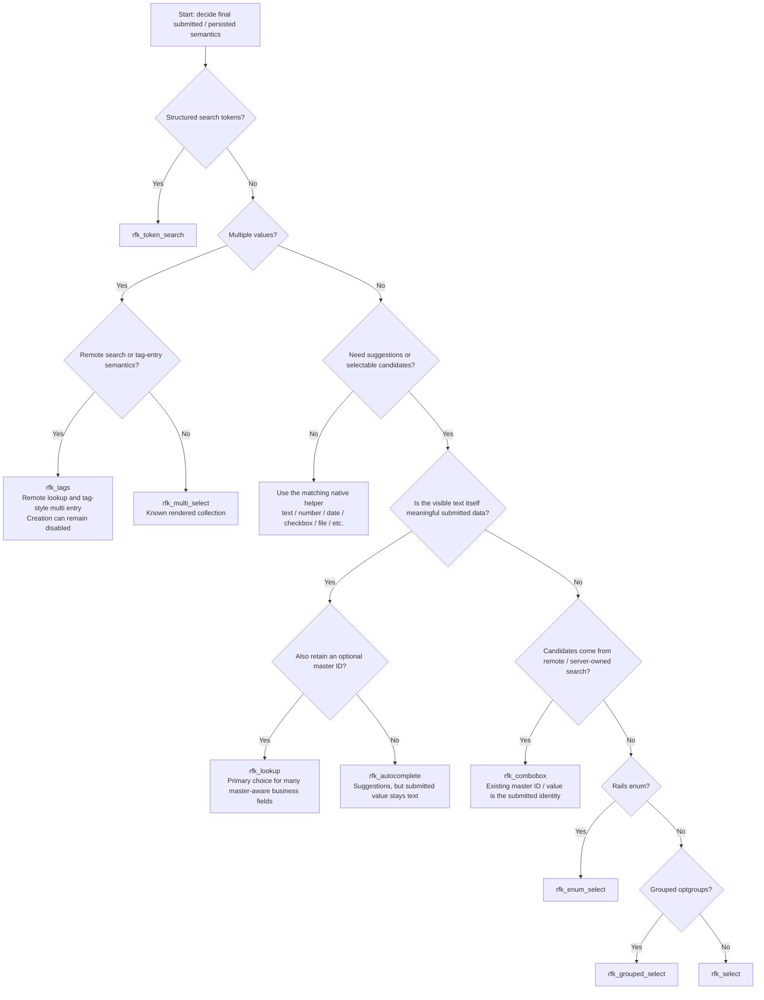
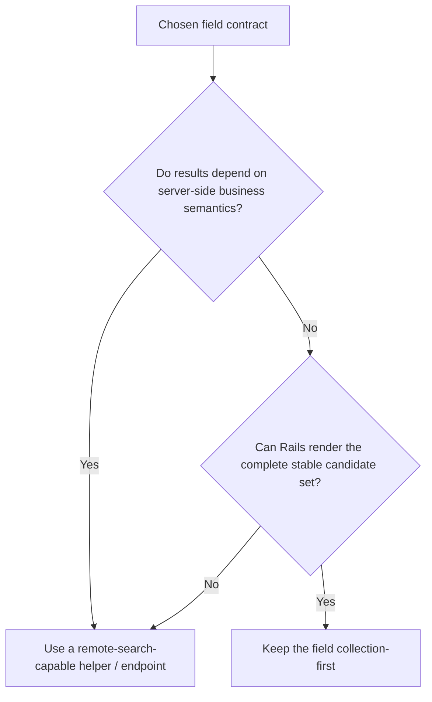

# Rails Fields Kit Quick Guide

Read this before the individual helper references.

This guide answers two questions before API details:

1. **Which helper matches the final submitted / persisted semantics?**
2. **Should the candidate search stay collection-first or move to a remote endpoint?**

Once those decisions are made, use [`field_helpers.md`](field_helpers.md) and [`public_api.md`](public_api.md) for the exact options supported by the installed Rails Fields Kit version.

## Start from the final data semantics

Do not choose a helper only because it is the simplest thing that can render the first version of the screen.

In business applications, a field that starts as a plain select often grows into requirements such as:

- code and name search
- kana normalization
- half-width / full-width normalization
- alias search
- tenant or authorization scope
- active / inactive filtering
- remote result limits
- exact match by selected master ID
- free-text fallback when no master record exists
- restoring the selected label on edit forms

Changing the helper later can affect submitted params, query objects, strong parameters, selected-value restoration, remote endpoints, and tests. If the finished semantics are already visible, implement that contract from the start.

## Field selection decision flow

Use the flow from top to bottom. The primary decision is **what the field means when submitted**, not which widget looks simplest today.



The candidate count is not the primary decision rule. **Submitted semantics and search semantics are.**

## Why `rfk_lookup` is often the first candidate

For master-related business inputs, start by asking whether the visible text is itself meaningful and should remain valid even when no master record is selected.

That common shape is exactly what `rfk_lookup` represents:

```text
item_name   = "On-site adjustment work"
product_id  = nil
```

or, after selecting a master candidate:

```text
item_name   = "Server setup"
product_id  = 123
```

The text remains the business value while the master ID is additional identity when available.

Typical examples include:

- order or estimate line item name + optional product ID
- delivery destination text + optional address/master ID
- free-form work name + optional service master ID
- search filters where a selected candidate means exact ID matching but manual text means LIKE matching

For this shape, do not collapse the text and ID into one `value_field:`. Keep them separate.

```erb
<%= f.rfk_lookup :item_name,
  id_field: :product_id,
  url: search_options_path("products"),
  selected_url: search_options_path("products"),
  placeholder: "Search or enter an item" %>
```

Use `rfk_combobox` instead when arbitrary text is not a valid state and the existing master ID/value itself is the persisted identity.

## Single-value choice summary

| Final semantics | Preferred helper |
| --- | --- |
| Meaningful text + optional master ID | **`rfk_lookup`** |
| Existing remote master ID/value is mandatory | `rfk_combobox` |
| Suggestions help typing, submitted value always stays text | `rfk_autocomplete` |
| Fixed rendered candidates | `rfk_select` |
| Rails enum | `rfk_enum_select` |
| Fixed grouped `<optgroup>` candidates | `rfk_grouped_select` |
| Structured query text such as `status:open keyword` | `rfk_token_search` |

## Multiple-value choice summary

Multiple-value fields deserve an explicit branch instead of being treated as a variation of a single select.

| Final semantics | Preferred helper |
| --- | --- |
| Known rendered collection, ordinary array of selected IDs/values | `rfk_multi_select` |
| Remote multiple lookup, tag-entry interaction, or optional create-on-the-fly | `rfk_tags` |

`rfk_tags` does not imply that the host application must allow creation. Leave create-on-the-fly disabled when the field should only select existing remote records.

## Simple / native fields

Do not introduce Tom Select semantics when an ordinary browser input already matches the requirement. Use the native wrapper helpers so the field still gets the shared Rails Fields Kit wrapper, hint, error, affix, and accessibility behavior.

| Requirement | Preferred helper |
| --- | --- |
| Plain text | `rfk_text_field` |
| Long text | `rfk_text_area` |
| Ordinary keyword/search input without remote suggestions | `rfk_search_field` |
| Numeric value | `rfk_number_field` |
| Money | `rfk_money_field` |
| Percentage | `rfk_percent_field` |
| Range slider | `rfk_range_field` |
| Email | `rfk_email_field` |
| URL | `rfk_url_field` |
| Phone | `rfk_phone_field` |
| Password | `rfk_password_field` |
| Boolean | `rfk_check_box` |
| One explicit radio choice | `rfk_radio_button` |
| File upload | `rfk_file_field` |
| Date | `rfk_date_field` |
| Time | `rfk_time_field` |
| Datetime-local | `rfk_datetime_local_field` |
| Color | `rfk_color_field` |

The existence of a more capable Tom Select-backed helper is not a reason to use it. Use the simplest helper that already matches the **finished** semantics.

## Remote search decision flow

After choosing the field contract, decide where candidate search belongs.



Use remote search when the server owns behavior such as:

- kana normalization
- Unicode / NFKC normalization
- half-width / full-width normalization
- code + name cross-field search
- aliases or alternative names
- tenant or department scope
- authorization
- active-state filtering
- dynamic availability
- result ranking or result limits

A small master can still deserve remote search when these semantics matter. Conversely, a larger but fixed and stable collection can stay collection-first when simple client-side selection is sufficient.

A useful rule is:

> Use remote search when the result depends on server-side business semantics, not merely when the table is large.

The host application owns those search semantics. Rails Fields Kit owns the field contract and request wiring.

## Search filters: selected identity and manual text are different meanings

A common filter requirement is:

```text
selected master candidate -> exact match by ID
manual text               -> text / LIKE search
```

Use `rfk_lookup` so both meanings remain explicit:

```text
customer_text = "Acme"
customer_id   = 42     # selected candidate
```

or:

```text
customer_text = "acm"
customer_id   = nil    # manual free text
```

The query layer can branch on `customer_id.present?` instead of inferring identity from a formatted label.

See [`host_app_integration.md`](host_app_integration.md) for the public contract and integration boundary.

## Table metadata helpers are a separate entry point

When a table definition already owns filter/editor metadata, use:

- `rfk_table_filters`
- `rfk_table_cell_editors`

These are composition helpers rather than another field-semantic choice. The underlying filter/editor type should still follow the same decisions above.

## Keep app-specific behavior outside the gem contract

Rails Fields Kit should describe reusable field semantics. Host applications should still own:

- endpoint names and routes
- domain-specific normalization rules
- authorization and tenant scope
- query-object behavior
- result ranking
- initial blank-query policy
- result limits
- app-specific CSS and overlay policy
- what to do with option metadata after selection

For example, selecting a product may also copy its unit or default price into an order line. That is a host-app workflow. Use Rails Fields Kit events and option metadata rather than replacing the core field contract with an app-specific helper when the public extension points are sufficient.

## Read next

After choosing the contract, continue with:

1. [`field_helpers.md`](field_helpers.md) — helper behavior and options
2. [`public_api.md`](public_api.md) — compact public API index
3. [`controller_helpers.md`](controller_helpers.md) — remote endpoint helpers
4. [`free_text_behavior.md`](free_text_behavior.md) — explicit free-text Tom Select behavior
5. [`host_app_integration.md`](host_app_integration.md) — host-app ownership and integration rules

For a host application, always read the documentation shipped with the installed gem version rather than assuming repository `main` matches the resolved dependency.